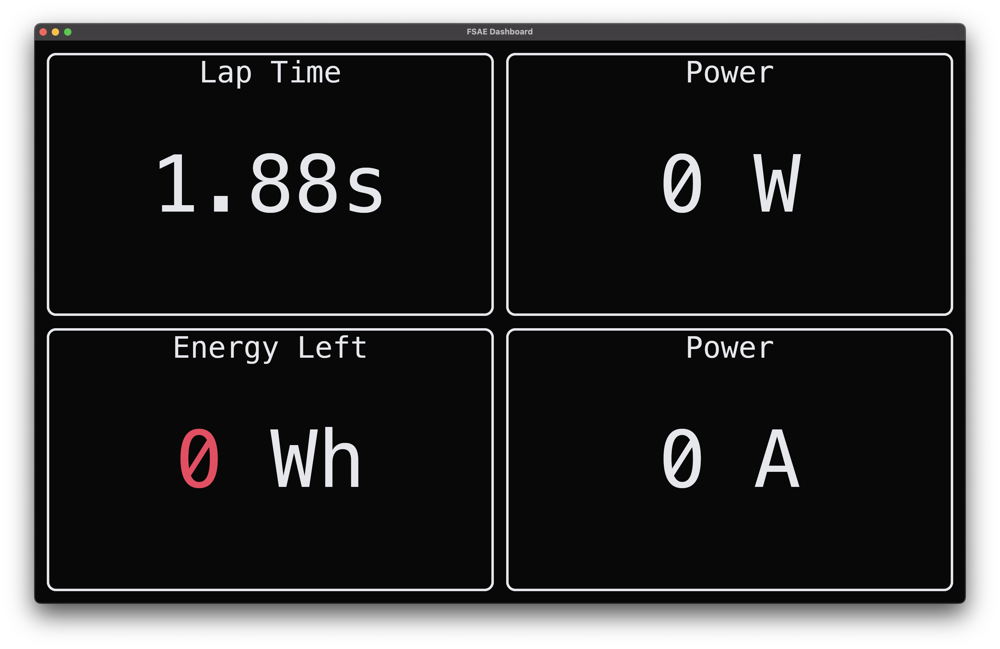

# Onboarding
## Relevant coding background to understand DAC
Git: [Video](https://www.youtube.com/watch?v=TFhbv6gw2Wo) || [Article](https://dev.to/ajmal_hasan/beginner-friendly-git-workflow-for-developers-2g3g)

Rust: [Book](https://doc.rust-lang.org/book/) && [Rustlings](https://github.com/rust-lang/rustlings/)

Cargo: [Guide (sections 1-2, optionally 3)](https://doc.rust-lang.org/cargo/getting-started/index.html)

Iced.rs: [Short Guide](https://book.iced.rs/index.html)

Tokio.rs: [Tutorial](https://tokio.rs/tokio/tutorial)

## Relevant hardware background to understand DAC
Raspberry Pi 5: [Fun Video](https://www.youtube.com/watch?v=UtLyX72-688)

Teensy 4.1: [Fun Video](https://www.youtube.com/watch?v=75IvTqRwNsE)

CAN protocol: [Video](https://www.youtube.com/watch?v=JZSCzRT9TTo)

## Codebase overview
Here is our codebase: [https://github.com/Anteater-Electric-Racing/embedded](https://github.com/Anteater-Electric-Racing/embedded)

### [fsae-dashboard](https://github.com/Anteater-Electric-Racing/embedded/tree/main/fsae-dashboard)

This dashboard displays current critical information to the driver

### [fsae-raspi](https://github.com/Anteater-Electric-Racing/embedded/tree/main/fsae-raspi)
This runs an mqtt broker, influxdb server, grafan server, and polls all correctly formatted isotp can data aoff of `/dev/can0` to send to both mqtt and influxdb.