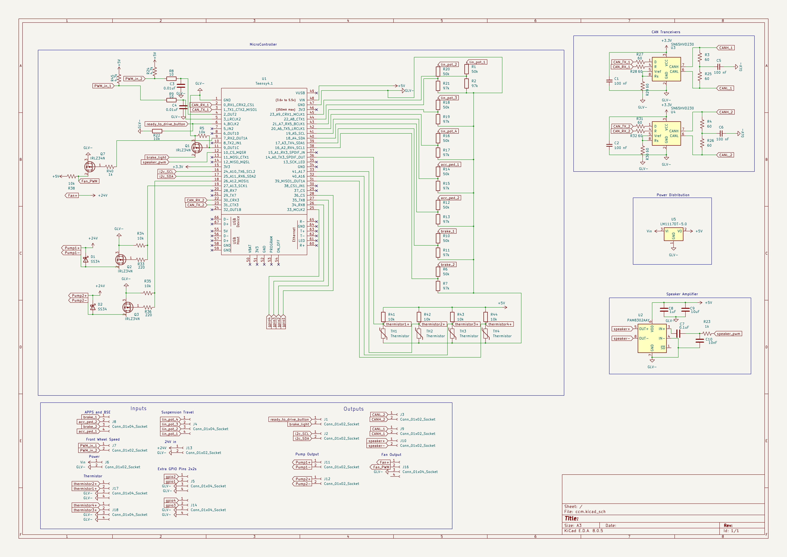
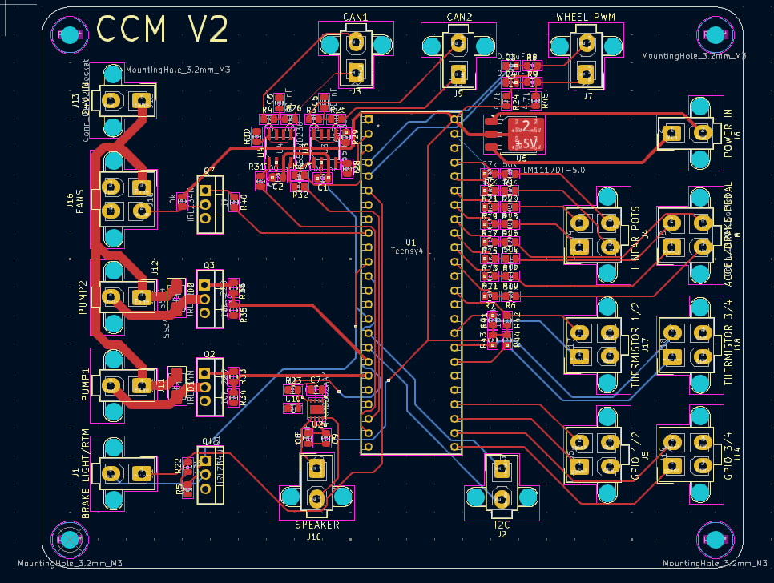

# CCM: Central Computer Module
CCM is the main central vehicle board. Its main purpose is to acquire data from sensors across the car, use it in vehicle control commands and send over CAN to our Raspberry Pi.

CCM is powered by (1) Teensy 4.1 MCU which runs an ARM-Cortex-M7. We write our firmware in C++ and flash it to our board. The board communicates with various devices over analog, digital, CAN and i2C.

The full kicad files can be found [here](https://github.com/Anteater-Electric-Racing/Precharge-Circuit/tree/v0.2).

Current Version: 2.0

## Schematic

- The top left shows the MCU pinout
- The top right shows the CAN Tranceiver setup
- The bottom shows the I/O

## PCB Layout

- The Right side holds all the analog inputs + 12v Power in
- The left side holds CAN1/CAN2 + PWM outputs from CCM as well as misc inputs.

## Improvements
This board has planned improvments for a version (3.0)
Some new features include
 - More sensors inputs (Tire Temp, Brake Temp, Steering Wheel Angle)
 - Input for Inverter Keyswitch (KL15)
