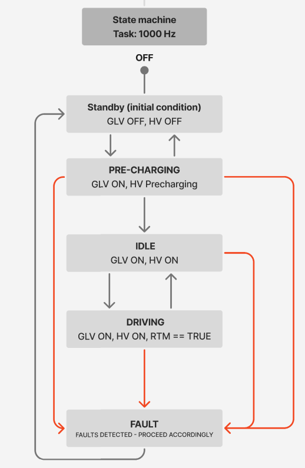

Author: Karan Thakkar
# Vehicle Control

## Motor/Inverter
The motor inverter in this system is responsible for controlling how power flows from the high-voltage battery to the traction motor, and its behavior is managed through a well-defined state machine aligned with Formula SAE Electric vehicle requirements.

The inverter is commanded through CAN messages that include torque requests, motor mode, relay control, and system readiness.

Depending on the operating state—such as OFF, STANDBY, PRECHARGING, IDLE, DRIVING, or FAULT—the inverter receives different command values that ensure the vehicle only delivers torque when it is electrically safe to do so. During driving, the requested torque is converted into a percentage value that the inverter understands, while additional parameters like regen mode, gear mode, and allowable currents from the BMS are also communicated. This helps maintain smooth torque delivery and ensures that high-voltage operation meets safety rules set by FSAE.

The transitions between inverter states are based on system conditions such as the Ready-To-Move button, precharge status, BMS confirmations, and overall system health.

For example, the inverter does not enter the DRIVING state until the precharge process has completed, battery relays are confirmed closed, and the driver actively requests propulsion. If communication issues or electrical faults occur, the inverter is immediately commanded into a FAULT state to disable torque and open relays where needed.

By structuring inverter behavior around explicit state transitions and safety checks, the system guarantees predictable and rules-compliant operation while providing clear separation between low-voltage logic and high-voltage power control, which is a core requirement for competition-legal and reliable Formula SAE EV design.

## State Machine

## Fault Handling
This fault map system uses a single 32-bit variable to keep track of all vehicle faults. Each fault type has its own bit in the bitmap, and when a fault is detected, its bit is turned on. When the fault clears, the bit is turned off. This makes fault storage very compact and fast to check, which is helpful on embedded systems where memory and CPU time matter. The system can quickly tell if any fault is active or look at specific bits to see which ones are triggered.

The handler function then looks at the bitmap and sets the motor into a fault state if any fault is active. Right now, every fault is treated the same, but the structure is flexible enough to customize actions later, such as limiting torque for minor issues or shutting down the drivetrain for serious ones. This design keeps the code organized, easy to maintain, and simple to expand as the system grows.
