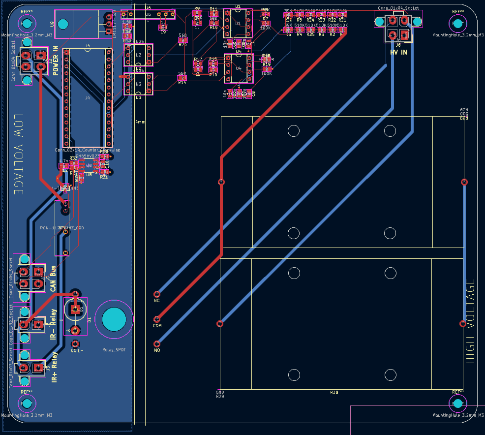
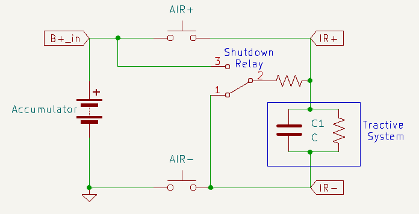

# Pre-Charge Circuit

---

The pre-charge circuit is a subsystem that ensures that the accumulator (battery) will charge safely by limiting the inrush current to the car's tractive system when the car is first powered on. The tractive system (TS) refers to the Inverter and Motor of the car as a unit. Limiting the current protects the rest of the system from potential damage. Accumulator-TS current doesn't actually flow through the PCC , but rather the PCC will monitor their respective voltage levels and control the relays which connect Accumulator and TS. In the event of a shutdown, PCC is able to control relays and completely disconnect the accumulator from the TS.
Watch this video for a great explanation on why we need such a system, ours is very similar: https://www.youtube.com/watch?v=6-RndXZ5mR4

# Hardware

## How It Works

The PCC is split into two halves, high voltage (HV) and low voltage (LV). The HV side deals with accumulator and tractive system voltages which routinely go up to 400 V, while the LV side does not exceed 12 V. The FSAE rulebook specifies that there must be separation between these two voltage levels. However, we still need to communicate betweeen the two sides, as the teensy needs to read the voltages of accumulator and TS, both of which are on the HV side. In our circuit, this is accomplished using two optocouplers. Optocouplers achieve voltage separation utilizing an LED on one side (in this case HV) which will internally light up when there is a signal, and a phototransistor on the other side which will react to that LED.

### HV Side

Here is a schematic demonstrating our system. The PCC is constantly reading accumulator voltage and tractive system voltage which come from B+\_in and TS+, respectively. These are the most important connections to the system, and are fed into the board with a 2x2 molex connector. To read the voltages, the circuit utilizes two voltage to frequency converters, with input voltages that are stepped down with a voltage divider resistor network to be 1/10 of the actual value.

There are two Accumulator Isolation Relays (AIRs) in the PCC: AIR+ and AIR-. These AIRs are open air contact relays, capable of isolating very high voltages. In addition, there is a shutdown relay, which functions as a two way switch. We will refer to the shutdown relay as closed when it's in position 1, and open when it's in position 2. The precharge sequence and the states of these 3 relays during them is as follows:

**Precharge**: AIR+ is open, AIR- and shutdown relay are closed, TS is slowly and safely charged through the resistor.
**End of precharge**: When TS+ is 70% of B+\_in, the onboard teensy will tell AIR+ to close, bypassing the resistor. The system is ready.
**Error state**: When we receive a shutdown signal through Shutdown_in or from a too fast/too slow precharge (see video for explanation if confused), AIR+/- and shutdown relay open. This configuration disconnects the accumulator and safely discharges the tractive system.

### LV Side

Most of the complexity of the circuit are for the V2F converters, and those largely don't need to be worried about. What is important to understand here is that the V2F converters convert an analog voltage to a signal with a frequency proportional to that voltage. Meaning: the V2F output signal is oscillating between 1 and 0. When vin is high, that oscillation will be faster, and when it is low that oscillation will slow down.

Using the optocouplers to maintain separation, that signal is fed to the teensy which then samples that data, and is able to control the rest of the circuit. The detailed implementation of these LM331 V2F converters involve capacitors and resistors which should be tuned to special values, but for this discussion of the PCC we will not dive into that.

Additionally, information on TS voltage, accumulator voltage, and error data are being sent over CANBUS to the CCM. This requires two teensy pins and utilizes a CAN transciever module.

## Connecting Everything and Testing

Setting up the PCC can be confusing, and since it deals directly with accumulator voltage levels, it is important to understand how the wiring and connections work. Each of the connectors and what each pin is for are as follows:

**HV IN**
TS+/-: positive and negative terminals of the tractive system
B+\_in: Accumulator-side AIR+ pin
GNDS: Accumulator-side AIR- pin

**POWER IN**
Shutdown_in: active high shutdown signal that triggers safe discharging of tractive system
GLV-: Ground for GLV
12V: Positive terminal of GLV, or a 12 V power supply

**IR+ Relay and IR- Relay**
Shutdown_in: active high shutdown signal that triggers safe discharging of tractive system
GLV-, IR+\_GND: ground signals

**CAN Bus**
CANH/CANL: used for communication with CCM and other modules

**Setup**
To test or use PCC, in addition to the board itself, you will need:

- two open air relays
- one 12 V source
- Accumulator or a 400 V power supply
- Motor+Inverter or some capacitor to represent the load

To hook up the accumulator to the inverter, take the two open air relays and decide which of them be AIR+ and AIR-. Connect one pin from AIR+ to Accumulator+ and one pin from AIR- to Accumulator-. The other pin of AIR+ goes to the positive terminal of the actual tractive system, and the other pin of the AIR- goes to the negative terminal of the tractive system. Definitely triple check this configuration. Make sure everything is isolated, it's a good idea to use electrical tape over the contactors to avoid accidental shorting.

Now that the high-voltage components are hooked up, we need to connect the wires that allow PCC to monitor voltage levels. Connect the TS AIR+ pin to the TS+ pin of the HV IN connector, and the TS AIR- pin to TS-. Connect the accumulator AIR+ pin to B+\_in, and the accumulator AIR- pin to GNDS. You will need to crimp wires and prepare a 2x2 molex connector.

Finally, we need to connect the PCC to the relays, so it can control them and open them in the case of a fault. The IR+/- ports correspond to AIR+/-, respectively. Simply connect them to their respective relays with Shutdown_in as the high input and with GND as low. After connecting CAN, the PCC is properly set up.

# Software

## Important Modules

### General Overview

As mentioned in HV, the PCC is constantly reading the accumulator voltage and tractive system voltage and printing them to the serial monitor. As it does so, it transitions between four possible states: **STANDBY**, **PRECHARGE**, **ONLINE**, and **ERROR**.

1. STANDBY (`void standby()`): The initial/idle state of the PCC. Waits for a stable shutdown circuit (SDC). Opens accumulator isolation relays (AIR) and precharge relay. If the accumulator voltage is greater than or equal to the minimum voltage for the shutdown circuit (`PCC_MIN_ACC_VOLTAGE`), transitions into the PRECHARGE state.
2. PRECHARGE (`void precharge()`): Closes AIR- and precharge relay. Monitors precharge progress, which is a function of the tractive system voltage and accumulator voltage. If the precharge progress is completed (`prechargeProgress >= PCC_TARGET_PERCENT`), checks if the target percentage was reached too quickly. If so, transitions into the ERROR state. Otherwise, transitions into the ONLINE state. If the precharge is too slow, it will also transition into the ERROR state.
3. ONLINE (`void running()`): The status that indicates that precharge has safely and successfully completed. Closes AIR+ to connect accumulator (ACC) to tractive system (TS) and opens precharge relay.
4. ERROR (`void errorState()`): The PCC error status. Opens AIRs and precharge relay.

`epoch` refers to system time (?)

### main.cpp

`void setup()`: Initializes GPIO pins and the precharge system.

`void threadMain()`: Continuously reads accumulator voltage and tractive system voltage and switches between the four states based on corresponding conditions.

### precharge.cpp

`getFrequency(int pin)`: Gets frequency of a square wave signal from a GPIO pin.

`getVoltage(int pin)`: Converts the frequency into voltage for accumulator or tractive system GPIO pins.

`prechargeInit()`: Initializes the mutex and precharge task.

`prechargeTask(void *pvParameters)`: Handles the state machine and status updates.

`void standby()`, `void precharge()`, `void running()`, `void errorState()`: See General Overview.

`float getTSVoltage()`: Gets the tractive system voltage.

`float getAccumulatorVoltage()`: Gets the accumulator voltage.

`PrechargeState getPrechargeState()`: Returns the current precharge state (undefined, standby, precharge, online, or error).

`getPrechargeError()`: Returns current error information as an error code.

### gpio.cpp

Initializes GPIO pins (shutdown control pin, accumulator pin, tractive system pin).

### can.cpp

CAN communication.

# Improvements + next steps

- Clean up code (get rid of duplicate and unncessary comments)
- Replace B+\_in and TS+ wire housings which barely fit inside 2x2 molex connectors
