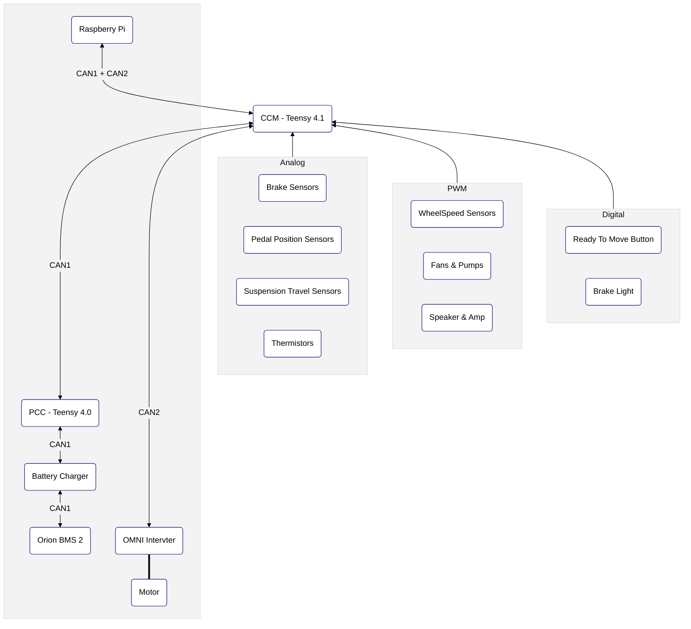
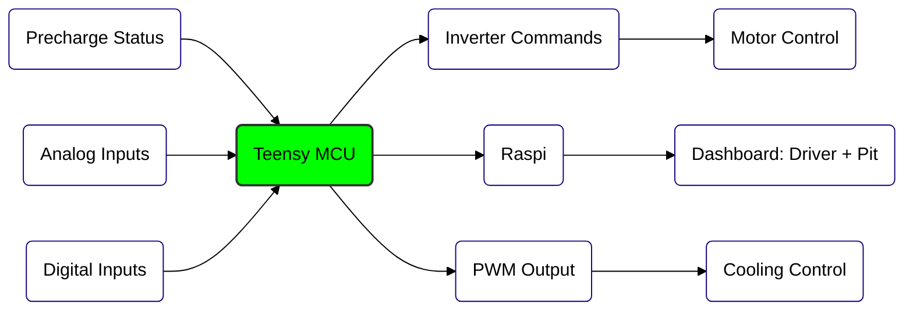

Author: Karan Thakkar
# System Architecture
<!--test holding of diagrams-->

```mermaid
---
config:
  theme: 'base'
  themeVariables:
    primaryColor: '#ffffffff'
    primaryTextColor: '#000000ff'
    primaryBorderColor: '#17007cff'
    lineColor: '#000000ff'
    secondaryColor: '#f3f3f3ff'
    tertiaryColor: '#f3f3f3ff'
---
flowchart BT
    %% This is a comment for the entire diagram

     subgraph CAN[" "]

            BMS(Orion BMS 2)
            BC(Battery Charger)
            PCC(PCC - Teensy 4.0)
            INV(OMNI Intervter)
            RPI(Raspberry Pi)
            MOTOR(Motor) === INV
        end

        CCM(CCM - Teensy 4.1)


        %%CAN LOOP1
        BMS <--> |CAN1| BC <--> |CAN1| PCC <---> |CAN1| CCM

        %%CANLOOP2
        INV<-----> |CAN2|CCM<---> |CAN1 + CAN2|RPI


        subgraph Analog[Analog]
            direction LR
                B(Brake Sensors)
                A(Pedal Position Sensors)
                LPOT(Suspension Travel Sensors)
                TR(Thermistors)
        end

        subgraph PWM[PWM]
            direction LR
                W(WheelSpeed Sensors)
                FP(Fans & Pumps)
                SP(Speaker & Amp)
        end
        subgraph MISC[Digital]
            direction LR
                RTM(Ready To Move Button)
                BL(Brake Light)
        end

        Analog --> CCM
        PWM --> CCM
        MISC -->CCM
```

```mermaid
---
config:
  theme: 'base'
  themeVariables:
    primaryColor: '#ffffffff'
    primaryTextColor: '#000000ff'
    primaryBorderColor: '#17007cff'
    lineColor: '#000000ff'
    secondaryColor: '#f3f3f3ff'
    tertiaryColor: '#f3f3f3ff'
---
flowchart LR
PCC(Precharge Status) --> CCM
A(Analog Inputs) --> CCM
D(Digital Inputs) --> CCM
CCM(Teensy MCU) --> IC(Inverter Commands) --> Motor(Motor Control)
CCM --> Raspi(Raspi) --> Dashboard(Dashboard: Driver + Pit)
CCM --> PWM(PWM Output) --> CC(Cooling Control)

style CCM fill:#00FF00,stroke:#333,stroke-width:2px

```

# Tasks and Threads

