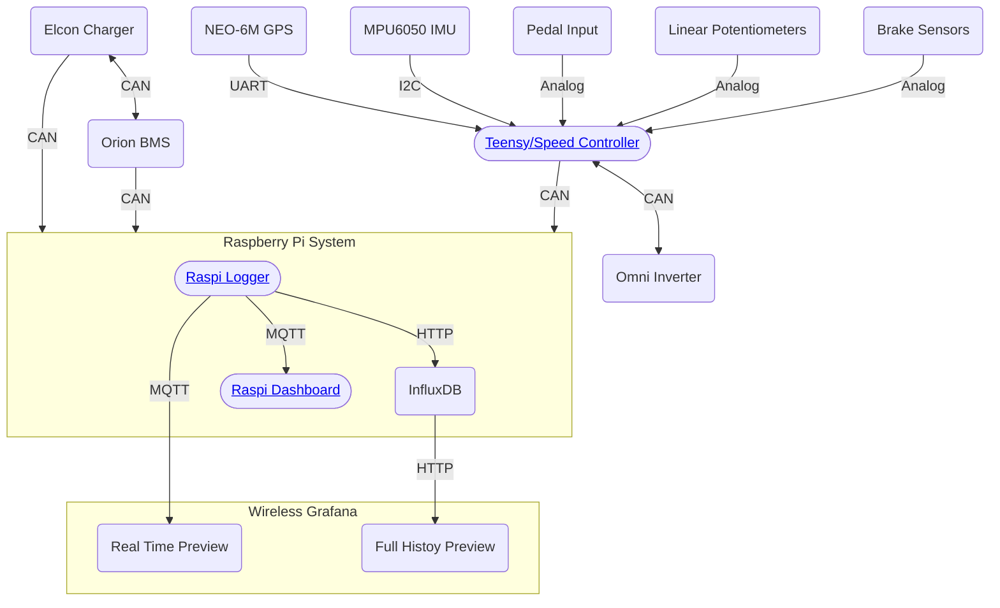

## System Architecture

```mermaid
flowchart TD
    B(Brake Sensors) -->|Analog| SC(["<a href='https://github.com/AlistairKeiller/FSAE/tree/master/fsae-vehicle-fw' target='_blank'>Teensy/Speed Controller</a>"])
    L(Linear Potentiometers) -->|Analog| SC
    PI(Pedal Input) -->|Analog| SC
    O(Orion BMS) -->|CAN| Pi
    %% OI(Omni Inverter) -->|CAN| Pi
    SC(Teensy Omni Speed Controller) -->|CAN| Pi
    IMU(MPU6050 IMU) -->|I2C| SC
    GPS(NEO-6M GPS) -->|UART| SC
    IMS(Elcon Charger) -->|CAN| Pi
    IMS(Elcon Charger) <-->|CAN| O
    SC(["<a href='https://github.com/AlistairKeiller/FSAE/tree/master/fsae-vehicle-fw' target='_blank'>Teensy/Speed Controller</a>"]) <-->|CAN| OI(Omni Inverter)
    subgraph Pi[Raspberry Pi System]
        R(["<a href='https://github.com/AlistairKeiller/FSAE/tree/master/fsae-raspi' target='_blank'>Raspi Logger</a>"]) -->|HTTP| I(InfluxDB)
        R -->|MQTT| D(["<a href='https://github.com/AlistairKeiller/FSAE/tree/master/fsae-dashboard' target='_blank'>Raspi Dashboard</a>"])
    end
    subgraph Graphana[Wireless Grafana]
        I -->|HTTP| F(Full Histoy Preview)
        R -->|MQTT| P(Real Time Preview)
    end
```

## State Machine
## Tasks and Threads
