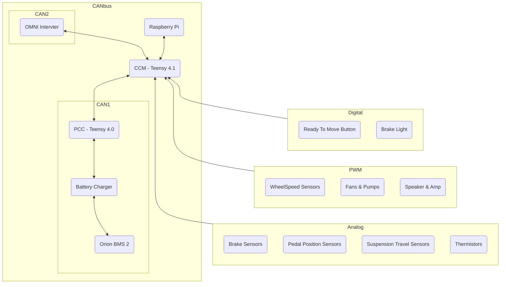

## Fimrware System Architecture
 <!-- This is a comment that will not be rendered in HTML output. -->

```mermaid
flowchart BT
    %% This is a comment for the entire diagram
    subgraph CANbus

        subgraph CAN1
            BMS(Orion BMS 2)
            BC(Battery Charger)
            PCC(PCC - Teensy 4.0)
        end


        subgraph empty[" "]
            CCM(CCM - Teensy 4.1)
            RPI(Raspberry Pi)
        end

        style empty stroke-width:0px


        subgraph CAN2
            INV(OMNI Intervter)
        end

        CAN1~~~empty~~~CAN2


        %%CAN LOOP1
        BMS <--> BC <--> PCC <--> CCM

        %%CANLOOP2
        INV<-->CCM<-->RPI
    end


        subgraph Analog[Analog]
                B(Brake Sensors)
                A(Pedal Position Sensors)
                LPOT(Suspension Travel Sensors)
                TR(Thermistors)
        end

        subgraph PWM[PWM]
            W(WheelSpeed Sensors)
            FP(Fans & Pumps)
            SP(Speaker & Amp)
        end
        subgraph MISC[Digital]
            RTM(Ready To Move Button)
            BL(Brake Light)
        end

        Analog~~~PWM~~~MISC

        Analog --> CCM
        PWM --> CCM
        MISC -->CCM


```

## State Machine
## Tasks and Threads
